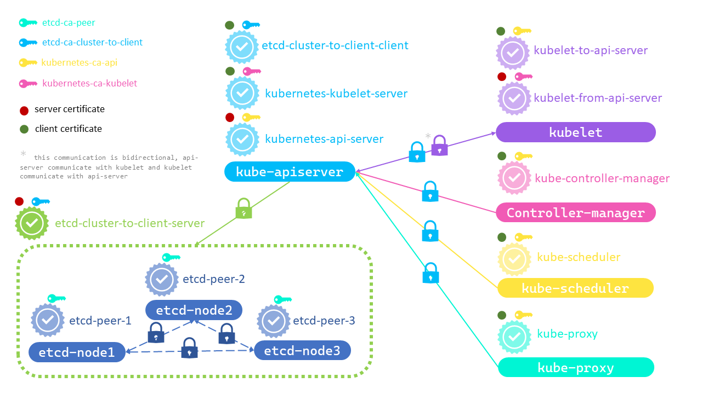

# Kubernetes The Hard Way

This tutorial is partially based on [Kubernetes The Hard Way](https://github.com/kelseyhightower/kubernetes-the-hard-way).

The main focus of this tutorial is to figure out with the certificates used in Kubernetes cluster.

TLS certificates are used in Kubernetes to secure communication between components within the cluster. Each component has its own certificate issued by a trusted Certificate Authority (CA) (in our case we will have sevaral different certificate authorities, for separate cluster components), which is used to authenticate its identity. The CA’s public certificate is used by components to verify the validity of other components’ certificates, ensuring secure communication and protection of sensitive data or services. Additionally, client certificates are used to identify users accessing the cluster, while server certificates identify Kubernetes components such as the API server, etcd, or kubelet.

At the end, we will have cluster configured with the next communication schema


To configure the cluster mentioned, we will use Ubuntu server 20.04 (author uses the VM in Hetzner).

## Copyright
<a rel="license" href="http://creativecommons.org/licenses/by-nc-sa/4.0/"></a><br />This work is licensed under a <a rel="license" href="http://creativecommons.org/licenses/by-nc-sa/4.0/">Creative Commons Attribution-NonCommercial-ShareAlike 4.0 International License</a> (whatever it means).

## Prerequisites
  
In this laboratory session, we'll be actively utilizing the cfssl and cfssljson tools. You can install these tools by executing the command provided below.
```bash
{
  wget -q --show-progress --https-only --timestamping \
    https://github.com/cloudflare/cfssl/releases/download/v1.4.1/cfssl_1.4.1_linux_amd64 \
    https://github.com/cloudflare/cfssl/releases/download/v1.4.1/cfssljson_1.4.1_linux_amd64

  mv cfssl_1.4.1_linux_amd64 cfssl
  mv cfssljson_1.4.1_linux_amd64 cfssljson
  chmod +x cfssl cfssljson
  sudo mv cfssl cfssljson /usr/local/bin/
}
```

## Labs
* [ETCD](./docs/00-etcd.md)
* [Api Server](./docs/01-api-server.md)
* [Kubelet](./docs/02-kubelet.md)
* [Controller manager](./docs/03-controller-manager.md)
* [Scheduler](./docs/06-scheduler.md)
* [Kube-proxy](./docs/07-kubeproxy.md)